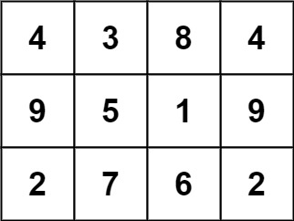

***Question 840. Magic Squares In Grid***
 
A 3 x 3 magic square is a 3 x 3 grid filled with distinct numbers from 1 to 9 such that each row, column, and both diagonals all have the same sum.

Given a row x col grid of integers, how many 3 x 3 contiguous magic square subgrids are there?

Note: while a magic square can only contain numbers from 1 to 9, grid may contain numbers up to 15.

Example 1:

solution:
solve the probleam by 

    step 1: identify the 3x3 subgrids 

    step 2: verify if each of the subgrids

    step 3: count how many of magic squares are valid.

Pseudocode 

1, define object is magic square that take (grid, row, col) as parameter.

     - check if the magic square can  contain numbers from 1 to 9, 

     -  check if the sum of the rows, columns and diafonals are equal.

2, intialize count to 0. 

3, loop through each possible starting point of 3x3 subgrid in the grid. 

4, return count.

Data stracture and Algoritm I have 
used:

    - Data stracture - 2D Arraay (Grid)

    - Algorithm Logic:  

    1, Nested Loop
    2, set
    3, summation and comparison

